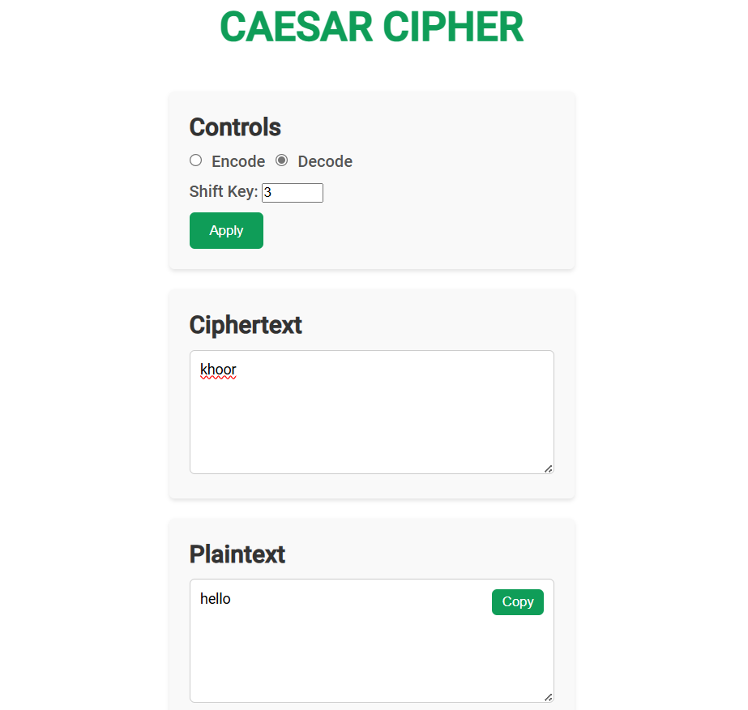
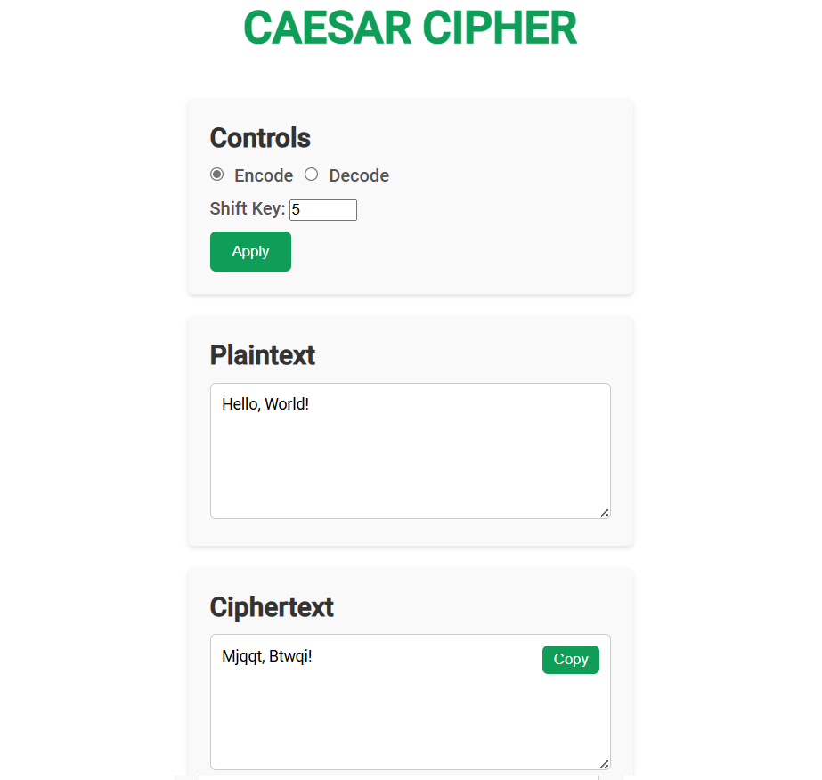
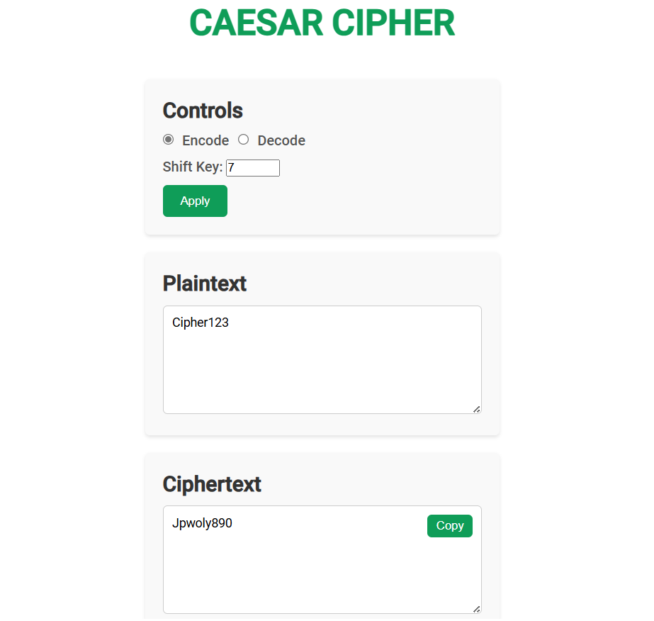

# Caesar Cipher Tool Documentation

## Table of Contents
1. [Project Overview](#project-overview-)
2. [Installation](#installation-)
3. [Usage](#usage-)
4. [Encryption Algorithm](#encryption-algorithm-)
5. [Examples](#examples-)

## Project Overview 📝
The Caesar Cipher Tool is a web-based application that enables users to encrypt and decrypt messages using one of the earliest known encryption methods. The tool implements the Caesar Cipher, a substitution cipher that shifts each letter in the plaintext by a fixed number of positions down the alphabet. Built to focus on educational value and user experience, it offers a user-friendly interface for understanding basic cryptographic concepts.

## Installation ⚙️
To install and run the Caesar Cipher Tool locally, follow these steps:

1. Clone the project repository:
```bash
git clone https://github.com/RobCyberLab/Caesar-Cipher-Tool.git
```

2. Navigate to the project directory:
```bash
cd src
```

3. Open the `index.html` file in your preferred web browser.

## Usage 📖
1. Access the Caesar Cipher Tool by opening index.html in your web browser
2. The interface presents two main sections:
   - **Input Section**
     - Enter the text you want to process
     - Select operation mode (Encode or Decode)
     - Set the shift value (1-25)
     - Click "Apply" button
   - **Output Section**
     - View the processed text result
     - Use "Copy" button to copy the result
3. The application will display:
   - The encoded/decoded result in the output area
   - Any error messages if input validation fails

## Encryption Algorithm 🔐
The Caesar Cipher implementation includes distinct handling for letters and numbers:

### Letter Processing

- Case-sensitive processing
- Modulo 26 operation for alphabet bounds
- ASCII code manipulation

```javascript
// Letter Shifting
let code = char.charCodeAt(0);
let baseCode = char === char.toUpperCase() ? 65 : 97;
code = (code - baseCode + shift) % 26 + baseCode;
char = String.fromCharCode(code);
```

### Number Processing

- Modulo 10 operation for digit bounds
- ASCII adjustment for numeric values

```javascript
// Number Shifting
char = String.fromCharCode((char.charCodeAt(0) - 48 + shift) % 10 + 48);
```

## Examples 📌

### Example 1: Basic Letter Encryption
Input:
```
hello
```
Shift: 3
Output:
```
khoor
```

<p align="center">
  
  <br>
  <em>Example 1: Encoding "hello" with a shift of 3</em>
</p>

### Example 2: Basic Decryption
Input:
```
khoor
```
Shift: 3
Output:
```
hello
```

<p align="center">
  
  <br>
  <em>Example 2: Decoding "khoor" with a shift of 3</em>
</p>

### Example 3: Mixed Case with Punctuation
Input:
```
Hello, World!
```
Shift: 5
Output:
```
Mjqqt, Btwqi!
```

<p align="center">
  
  <br>
  <em>Example 3: Encoding "Hello, World!" with a shift of 5</em>
</p>

### Example 4: Letters and Numbers
Input:
```
Cipher123
```
Shift: 7
Output:
```
Jpwoly890
```

<p align="center">
  
  <br>
  <em>Example 4: Encoding "Cipher123" with a shift of 7</em>
</p>

Note: The application includes several features to enhance usability:
- Case preservation for letters
- Special character preservation
- Number shifting with modulo 10
- Input validation
- Copy to clipboard functionality
- Real-time error messaging

These features ensure a smooth user experience while maintaining the educational value of the classical Caesar cipher implementation.